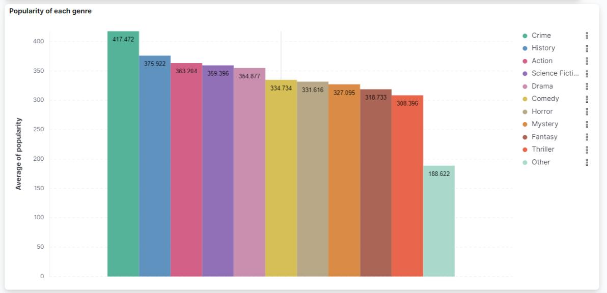

# IT4931-bigdata-Movie-processing
Course project.

The crawled movie data is streamed and processed by Kafka and PySpark. Storing data in MongoDB and visualizing by Elasticsearch Kibana. All the processes run on docker-compose windows 10. 

### Install (window local machine)
Docker, MongoDB, Pyspark

### Usage
#### Run docker-compose
```
IT4931-bigdata-Movie-processing\docker> docker-compose up
```
The codes in `app` are mounted in spark-master container 
#### Access the broker 1 container to create topic
Access broker 1 container
```
> docker exec -it <container broker 1 ID> /bin/bash
```
Create topic movie and actor with 3 partition and 2 replication factor
```
> kafka-topics.sh --bootstrap-server localhost:9092 --create --topic movie --partitions 3 --replication-factor 2

> kafka-topics.sh --bootstrap-server localhost:9092 --create --topic actor --partitions 3 --replication-factor 2
```
#### Create sharding DB for MongoDB cluster 
(Use cmd of local machine)

##### Config server replicaset
Access config server 
```
> mongosh localhost:40001
```
Create replicaSet for config server
```
> rs.initiate({_id: "cfgrs", configsvr: true, members:[{ _id: 0, host: "cfgsvr1:27017" }]})
```

##### Sharding server replicaset
Access shard1svr1
```
> mongosh localhost:50001
```
Create replicaSet for shard1
```
> rs.initiate({_id: "shard1rs",members: [{ _id : 0, host : "shard1svr1:27017" },{ _id : 1, host : "shard1svr2:27017" },{ _id : 2, host : "shard1svr3:27017" }]})
```
Access shard2svr1
```
> mongosh localhost:50004
```
Create replicaSet for shard2
```
> rs.initiate({_id: "shard2rs",members: [{ _id : 0, host : "shard2svr1:27017" },{ _id : 1, host : "shard2svr2:27017" },{ _id : 2, host : "shard2svr3:27017" }]})
```
##### Add shard server to router and create sharding DB
Access mongos router
```
> mongosh localhost:60000
```
Add shard1, shard2
```
> sh.addShard("shard1rs/shard1svr1:27017,shard1svr2:27017,shard1svr3:27017")
> sh.addShard("shard2rs/shard2svr1:27017,shard2svr2:27017,shard2svr3:27017")
```
Create sharding database `BIGDATA`
```
> sh.enableSharding("BIGDATA")
```
Create sharding collection
```
> sh.shardCollection("BIGDATA.movie", { id: 'hashed' })
> sh.shardCollection("BIGDATA.actor", { id: 'hashed' })
```

#### Run the producer and consumer in spark-master container
Access spark-master container
```
> docker exec -it <container spark-master ID> /bin/bash
```
Install python libs in container
```
pymongo==4.6.1
pyspark==3.2.3
python-dotenv==1.0.0
Requests==2.31.0
py4j
```
Change directory to mounted folder
```
> cd /opt/spark-applications
```
Run the producers and consumers
```
> python actor_consumer.py
> python movie_consumer.py
> python actor_producer.py
> python movie_producer.py
```

#### Visualize crawled data on Kibana
Access `localhost:5601` and create diagram on index movie and actor. Read the Kibana tutorial for more detail.
